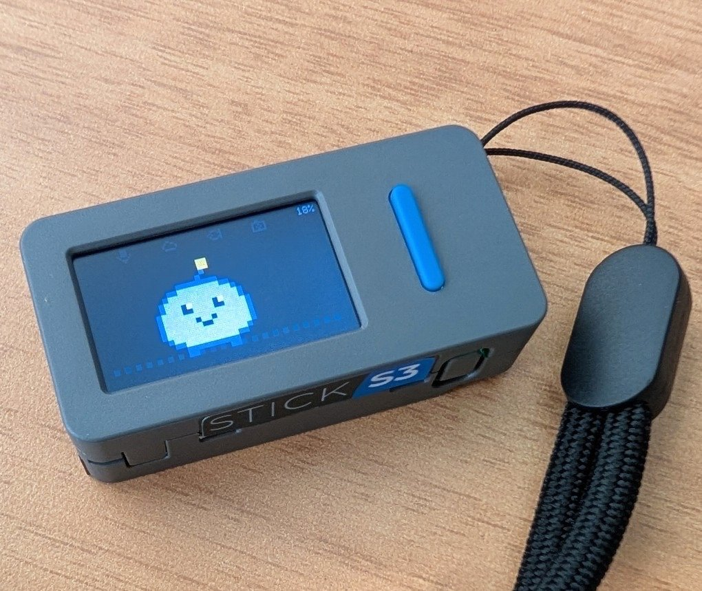
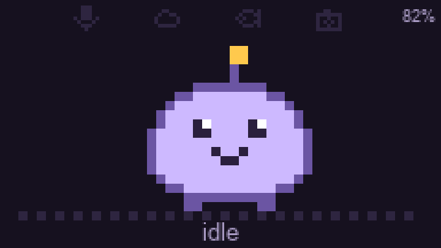
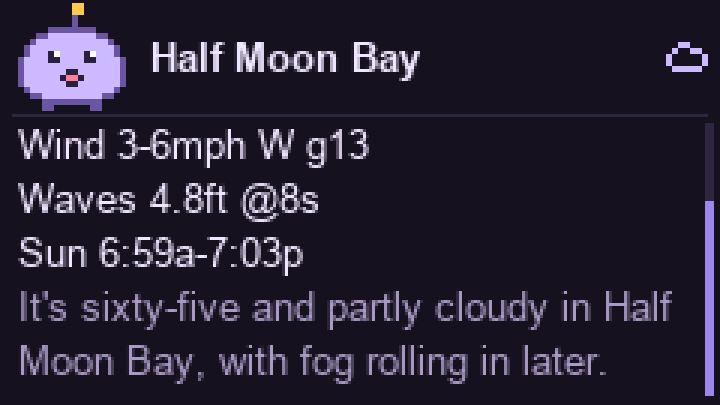
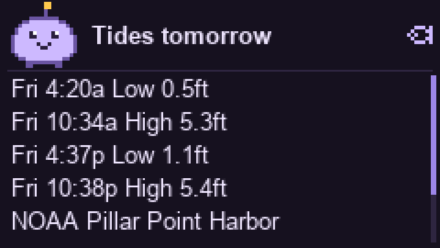
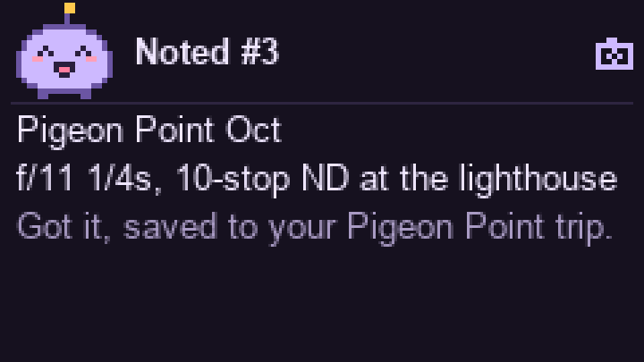

# Kai

<p align="center">
  
  <br><sub>Kai on a real M5StickS3 (48 × 24 × 15 mm, 20 g), clipped to a lanyard.</sub>
</p>

A pocket AI pal on an **M5StickS3**. Hold the button and ask; Kai answers out loud, with a pixel face
and a small info card. Quick questions get an answer in about two seconds. Bigger jobs ("research…",
"plan…", "tell me later") go to a background agent, and Kai tells you when they're done.

## How it works: a fast path and a slow path

```
                      home server
M5StickS3 ──TLS────▶ kai-relay ──▶ Gemini Live ................ FAST PATH: answers in ~2 s
 push-to-talk  Opus │   │          + Google Search, Kai's tools   (tides, weather, light, parking, notes)
 face + cards       │   │
                    │   └─ ask_agent ──▶ Hermes Agent ......... SLOW PATH: seconds to minutes
                    │                     (Docker, locked down)   (research, planning, many searches)
                    └──── inbox ◀── results, and Hermes's own updates (kai_notify)
```

| | **Fast path** | **Slow path** (optional) |
|---|---|---|
| Brain | Gemini Live (`gemini-3.8-live`), native voice | [Hermes Agent](https://github.com/nousresearch/hermes-agent) with Gemini Flash |
| Good for | facts, news, tides, weather, golden hour, parking, notes | research, comparing options, planning, anything needing several searches |
| Timing | you hear the answer in ~2 s | Kai says "On it"; the answer comes later |
| Delivery | spoken now, plus a card | spoken the moment it's ready if the Stick is awake; otherwise a badge, read out on "any updates?" |

- **The Stick stays thin.** It streams Opus audio (~24 kbit/s up, ~32 kbit/s down) over home Wi-Fi,
  draws the face and cards, and deep-sleeps between uses. The link to the relay is encrypted and
  mutually authenticated (TLS-PSK, one key per device).
- **The relay** (Python, on any always-on Linux box) bridges the Stick to Gemini Live. It also:
  - runs Kai's own tools: NOAA tides, Open-Meteo weather and marine, golden and blue hour, Google
    Places parking, trip notes;
  - makes sure a card appears even when Gemini skips a tool;
  - hands slow work to Hermes, and keeps the inbox.
- **Hermes** runs next to the relay in a pinned Docker container: web search, memory and skills, but no
  shell, file or browser tools, and nothing acts unattended. After each conversation it updates its
  memory of you and sends Kai a short brief, so Kai starts every conversation already knowing you.
  It reaches back into Kai through a small MCP server on localhost (`kai_notify` and Kai's data tools).
  Anything it brings back from the web is treated as data, never as instructions.

## Screens

<p align="center">
  
</p>

| Weather, mid-answer | Tides | Saved note |
|:---:|:---:|:---:|
|  |  |  |

<sub>Rendered from the firmware's sprite and layout code (`firmware/src/face.cpp`) at 3x; fonts are approximate.</sub>

## What you can ask

| Ask | Path | On screen |
|---|---|---|
| "Who won the Giants game?" | fast: Google Search | transcript |
| "When's high tide at Pillar Point tomorrow?" | fast: `get_tides` | the day's highs and lows |
| "What's the weather in San Mateo?" | fast: `get_weather` | temperature, high/low, rain, wind, waves |
| "When's golden hour at Pescadero Saturday?" | fast: `get_sun_times` | golden and blue hour, sunset clouds |
| "Find parking near the Ferry Building" | fast: `find_parking` | 5 closest |
| "Note: f/11, 1/4 s, 10-stop ND at the lighthouse" | fast: `save_note` | "Noted #3", filed under the current trip |
| "Research three sunrise spots near Half Moon Bay for this weekend, tell me later" | slow: `ask_agent` → Hermes | "On it", then the result card |
| "Any updates?" | `check_inbox` | the waiting results; the badge clears |
| "What did I say about Pigeon Point last month?" | slow: `recall` → Hermes memory | the answer, or an update if it takes a while |
| "Remind me at 5:30 to pack the ND filters" | `remind` (the relay's own) | chime and "Reminder" at 5:30, waking the Stick if needed |
| "Every Saturday at 5:45 give me a fishing brief for Pillar Point" | slow: `schedule_briefing` → Hermes job | chime and the brief every Saturday |
| "Tell me if the wind at Half Moon Bay drops under 10 mph this weekend" | slow: `watch_for` → Hermes job | chime and the news, once, when it happens |

"Here" and "near me" mean the home location in the relay's `.env` (`KAI_HOME_*`).

## Using it

| Button | Action |
|---|---|
| **Front** hold | talk; release to send. Pressing while Kai talks interrupts it. |
| **Side** click | scroll the reply; from the face, reopen the last reply |
| **Side** hold | hush Kai mid-answer; otherwise show status (Wi-Fi, relay, battery) |

- **Badge:** a yellow number in the top-left means updates are waiting.
- **Chime:** two rising notes mean Kai is about to tell you something you didn't just ask: a reminder,
  a briefing, a watch that fired, or a finished task. The Stick wakes itself for these; watches stay
  quiet at night (22:00–07:00).
- **Sleep:** Kai dims after 15 s. On battery it deep-sleeps after 45 s; either button wakes it, and
  holding the front button to wake records at once, so you can just press and talk. On USB the screen
  turns off at 45 s but Kai stays connected.
- **Battery:** about 6 days per charge at 20 questions a day (projected, see
  [docs/POWER.md](docs/POWER.md)).

## Setup

**1. Relay** on an always-on Linux box on your LAN (Raspberry Pi, mini PC, NAS); no sudo needed.
```bash
curl -LsSf https://astral.sh/uv/install.sh | sh
git clone https://github.com/zbruceli/kai ~/kai && cd ~/kai/relay
cp .env.example .env && chmod 600 .env && nano .env   # GEMINI_API_KEY, KAI_DEVICE_TOKEN, KAI_HOME_*
uv run kai-psk kai-stick1                             # a device key: KAI_DEVICE_PSKS line into .env
uv sync --frozen && uv run kai-relay                  # prints wss://<server-ip>:8443/ws
```
- **Keys:** get a Gemini key from [AI Studio](https://aistudio.google.com/apikey). Parking also needs a
  Maps key with Places API (New); everything else works without it.
- **Run at boot:** copy `deploy/kai-relay.service` to `~/.config/systemd/user/`, set its `TZ=`, then
  `loginctl enable-linger "$USER"` and `systemctl --user enable --now kai-relay`.
- **Logs:** `journalctl --user -u kai-relay -f` shows the transcript and tool calls.
- **Update:** `git pull && uv sync --frozen && systemctl --user restart kai-relay`.
- **Fixed IP:** give the server a DHCP reservation, because the Stick connects to its IP.

**2. Slow path (optional):** Hermes in Docker. Follow [relay/deploy/hermes/README.md](relay/deploy/hermes/README.md):
`docker compose up -d`, a few secrets, then `./configure.sh`. Without it, Kai simply has no `ask_agent`.

**3. Stick.**
```bash
cd firmware && cp src/secrets.example.h src/secrets.h   # Wi-Fi, RELAY_HOST, token, the kai-psk lines
pio run -t upload
```
If the port isn't found, hold the side button ~2 s until the green LED blinks (download mode). Builds
embed your Wi-Fi password, token and device key, so releases are source only; never share a built
`firmware.bin`. The link to the relay is encrypted and mutually authenticated (TLS-PSK); see
[docs/ARCHITECTURE.md](docs/ARCHITECTURE.md).

**Without a Stick:** `uv sync --extra sim && uv run kai-sim --host <server-ip>` talks to the relay through
the Mac's mic and speakers. Give it its own key: `KAI_SIM_PSK=kai-sim:<hex>` in `.env`, with the same entry
in the relay's `KAI_DEVICE_PSKS`.

**Tests:** `cd relay && uv run pytest` (offline). Add `-m network -s` to hit NOAA and Open-Meteo for real.
`uv run python evals/routing.py` checks which path Gemini Live picks for a set of requests (real Gemini, ~1 min per 30 cases).

## Repo map

```
firmware/src/   main.cpp (modes, buttons, Wi-Fi, sleep) · audio.* (mic, speaker) · voice_codec.* (Opus) · face.* (sprite, cards)
firmware/scripts/patch_websockets.py   adds TLS-PSK to the WebSockets library at build time
relay/kai_relay/
  server.py     listeners (wss:// with TLS-PSK) and device auth
  tls.py        the encrypted link; `kai-psk` makes device keys
  session.py    Stick <-> Gemini Live bridge; wire protocol at the top
  tools/        fast-path tools, one file each (@tool decorator)
  backstop.py   runs the tool itself when Gemini answers without one, so a card always appears
  agent.py      slow path: hand-off to Hermes, the inbox, the badge
  hermes.py     Hermes API client
  schedule.py   reminders, briefings, watches, and when the Stick should wake
  mcp_server.py Kai MCP server that Hermes calls back into
relay/evals/    routing eval: which path Gemini Live picks for a set of requests
relay/deploy/   systemd unit · hermes/ (pinned compose, configure.sh, SOUL.md)
```

More in [docs/ARCHITECTURE.md](docs/ARCHITECTURE.md) (protocol, tools, security),
[docs/POWER.md](docs/POWER.md) and [CHANGELOG.md](CHANGELOG.md).

## Roadmap

- [x] Voice, search, tides, weather, light, parking, notes, with cards
- [x] Deep sleep with press-and-talk from sleep; Opus audio; power savings
- [x] Slow path, phase 1: hand-off to Hermes, inbox with badge, results spoken when ready
- [x] Slow path, phase 2: memory across conversations (transcripts to Hermes, a profile brief Kai starts with, `recall`)
- [x] Slow path, phase 3: reminders, briefings and watches that wake the Stick on a timer
- [x] Encrypted Stick link (TLS-PSK), security audit and hardening, routing eval
- [ ] Approvals: a spoken read-back plus a long press before anything with side effects
- [ ] Remote access: phone as a BLE bridge (GPS for "near me"), or a relay reachable away from home
- [ ] IMU gestures (lift to wake, shake to hush), OTA updates

## License

MIT, see [LICENSE](LICENSE).
